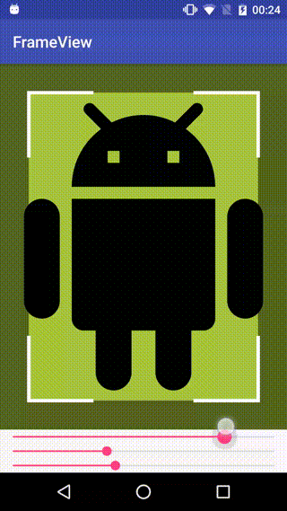

# FrameView
[  ](https://bintray.com/sthagios/maven/frameview/_latestVersion)
[](https://android-arsenal.com/details/1/5899)

Custom view written in Kotlin to Display a translucent frame with corners as known from cameras. You can set the frame's alpha, the frame size, the length of the lines in the corner, their color and the width of them.



## Gradle
```Groovy
compile 'com.sthagios:frameview:${version}'
```

## Usage
In your layout file:
```XML
<com.sthagios.frameview.FrameView
        android:layout_width="match_parent"
        android:layout_height="match_parent"
        app:frame_size="36dp"
        app:frame_alpha="125"
        app:line_color="#ff0000"
        app:line_length="16dp"
        app:line_width="2dp"/>
```
In your code(Kotlin):
```Kotlin
frameView.frameAlpha = 125
frameView.frameSize = 36
frameView.lineColor = Color.RED
frameView.lineLength = 16
frameView.lineWidth = 2
```

Or Java:
```java
frameView.setFrameAlpha(125);
frameView.setFrameSize(36);
frameView.setLineColor(Color.RED);
frameView.setLineLength(16);
frameView.setLineWidth(2);
```

## License
```
Copyright © 2017 Stephan Hagios, http://sthagios.com

Licensed under the Apache License, Version 2.0 (the "License");
you may not use this file except in compliance with the License.
You may obtain a copy of the License at

http://www.apache.org/licenses/LICENSE-2.0

Unless required by applicable law or agreed to in writing, software
distributed under the License is distributed on an "AS IS" BASIS,
WITHOUT WARRANTIES OR CONDITIONS OF ANY KIND, either express or implied.
See the License for the specific language governing permissions and
limitations under the License.
```
